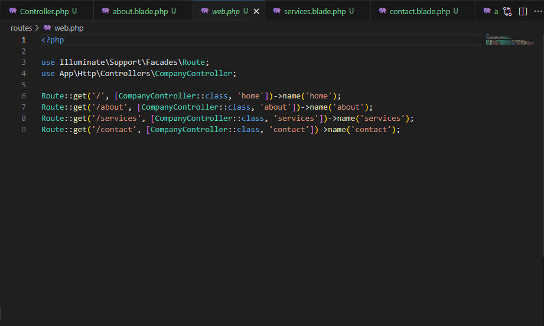
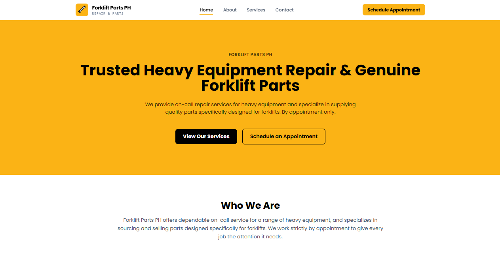
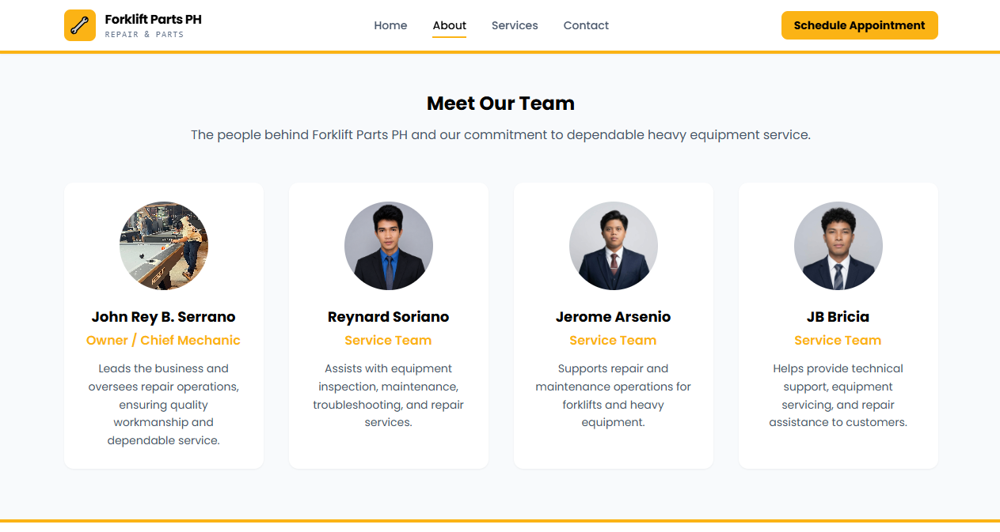
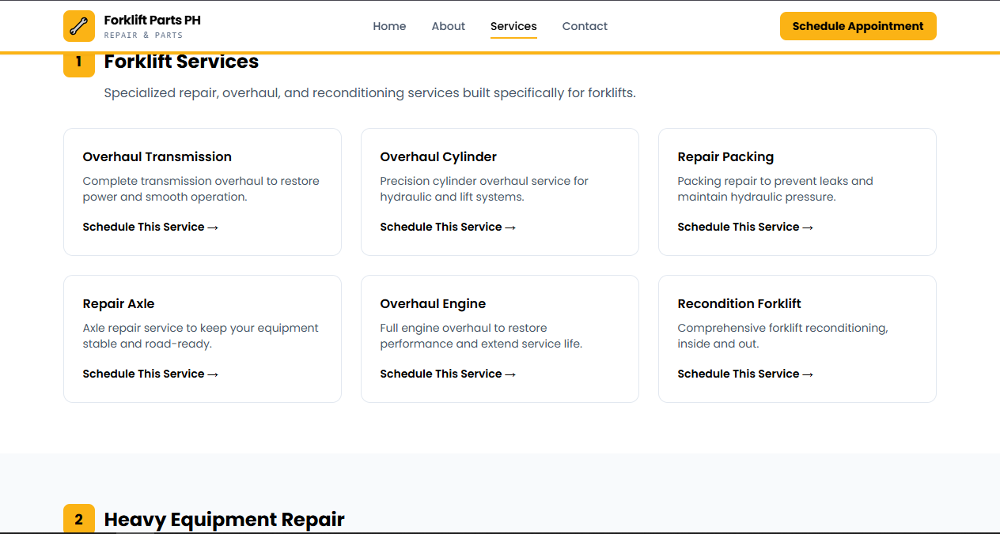
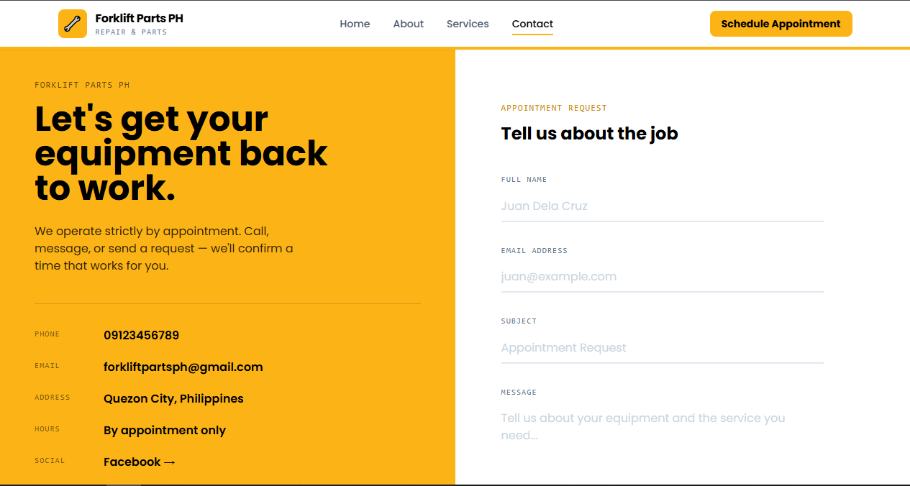
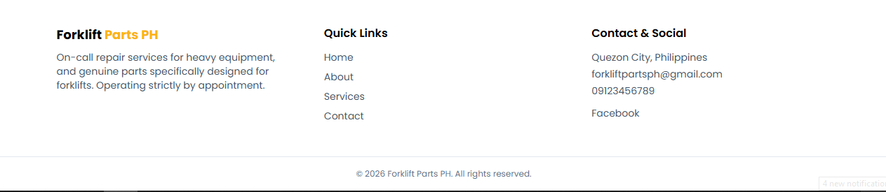
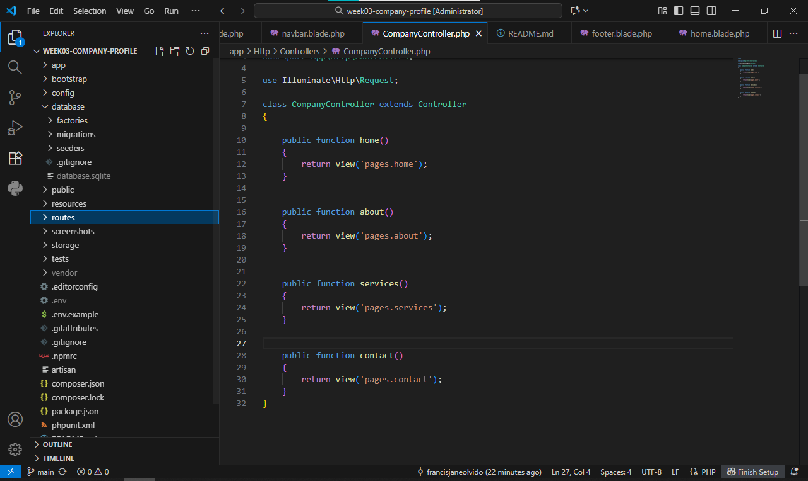
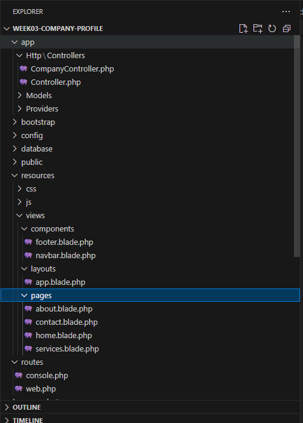
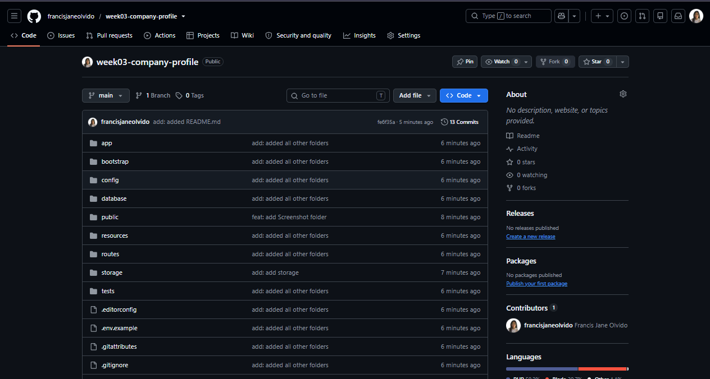
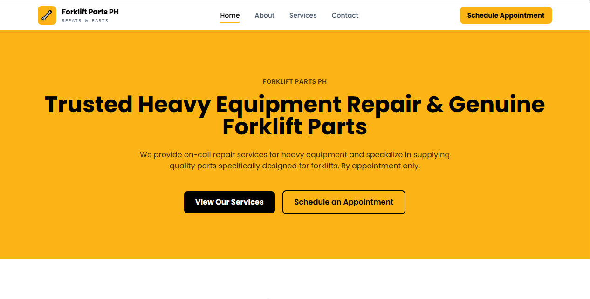

# Forklift Parts PH — Company Profile Website

A multi-page company profile website built with Laravel's MVC architecture, developed as part of my Week 3 laboratory activity for ITST 302 – Client-Server Technologies.

---

## 1. Introduction

A company profile website is an online presence that introduces a business to potential customers — who they are, what they offer, and how to reach them. Instead of relying only on word-of-mouth or social media posts, a company profile website gives a business a permanent, organized place where people can learn about its services, see proof of its work, and get in touch.

Businesses need a company profile website because it builds trust. When someone is deciding whether to book a repair service or ask for a quotation, a clean and informative website makes the business look more credible and easier to reach than a Facebook post alone. It also gives the business full control over how it presents itself, rather than depending only on third-party platforms.

The purpose of this project was to apply Laravel's MVC architecture to build a real, functioning multi-page website — practicing routing, controllers, and Blade templating while working with genuine business content instead of placeholder text.

---

## 2. Objectives

By completing this project, I was able to:

- Build a responsive, multi-page website using Laravel's MVC architecture
- Create and connect four named routes (Home, About, Services, Contact) to a single controller
- Develop `CompanyController` to handle each page's request and return the correct Blade view
- Build a reusable Blade layout (`layouts/app.blade.php`) shared across every page
- Create reusable navbar and footer components instead of duplicating HTML on each page
- Apply Blade directives (`@extends`, `@section`, `@yield`, `@include`) correctly across the project
- Style the site using Tailwind CSS to match a real brand identity (color palette and typography)
- Practice Git version control with a structured, meaningful commit history
- Publish the completed project to a public GitHub repository

---

## 3. MVC Architecture

**What is MVC?**

MVC stands for Model-View-Controller. It's a way of organizing an application into three separate responsibilities:

- **Model** – manages data and business logic (not used directly in this project since no database was required)
- **View** – handles what the user actually sees (in Laravel, this is the Blade templates)
- **Controller** – sits in between; it receives the request from the browser and decides which view to return

**Why Laravel uses MVC**

Laravel uses MVC so that each part of the application has one clear job. Routes decide *where* a request goes, controllers decide *what* should happen, and views decide *how* it looks. This keeps the codebase organized instead of mixing HTML, PHP logic, and routing all in one file.

**Advantages of MVC in software development**

- Easier to maintain — a change to the design doesn't require touching the logic, and vice versa
- Easier to debug — if a page shows wrong content, the problem is isolated to either the route, controller, or view
- Reusable components — the same layout, navbar, and footer are reused across every page without duplication
- Scalable — as a project grows, new features can be added without disturbing existing code

**Request Flow Diagram**

```
Browser
   │
   ▼
Route (web.php)
   │
   ▼
CompanyController
   │
   ▼
Blade View
   │
   ▼
HTML Response
   │
   ▼
Browser
```

When a user visits a page, the browser sends a request to Laravel. Laravel checks `routes/web.php` to see which route matches the URL, then calls the matching method inside `CompanyController`. That method returns a Blade view, which Laravel compiles into HTML and sends back to the browser as the final response.

---

## 4. Laravel Routing

**What is Routing?**

Routing is how Laravel decides what to do when a specific URL is visited. Every route maps a URL pattern to a piece of logic — in this project, that logic is a controller method.

**Named Routes**

Each route in this project is given a name using `->name('routeName')`. This allows Blade views to reference routes using `route('home')` instead of hardcoding URLs like `/`. If a URL ever changes, only the route definition needs updating — every link using `route()` updates automatically.

**GET Requests**

All four routes in this project use `Route::get()`, since each page simply displays information to the visitor and does not submit or process any data.

**Route Definitions**

```php
use Illuminate\Support\Facades\Route;
use App\Http\Controllers\CompanyController;

Route::get('/', [CompanyController::class, 'home'])->name('home');
Route::get('/about', [CompanyController::class, 'about'])->name('about');
Route::get('/services', [CompanyController::class, 'services'])->name('services');
Route::get('/contact', [CompanyController::class, 'contact'])->name('contact');
```

**Screenshot — `routes/web.php`**



---

## 5. Controllers

**Purpose of Controllers**

A controller acts as the middleman between a route and a view. Instead of writing logic directly inside `web.php`, controllers keep that logic organized in a dedicated class, which is one of the core ideas behind separation of concerns.

**Benefits of Controllers**

- Keeps `routes/web.php` short and readable
- Groups related logic together in one file (`CompanyController` handles all four company pages)
- Makes the codebase easier to scale — if the company later needs a `Blog` or `Careers` page, a new controller method can be added without cluttering the routes file

**Controller Methods**

`CompanyController` contains four methods — `home()`, `about()`, `services()`, and `contact()` — each of which simply returns its corresponding Blade view:

```php
class CompanyController extends Controller
{
    public function home()
    {
        return view('pages.home');
    }

    public function about()
    {
        return view('pages.about');
    }

    public function services()
    {
        return view('pages.services');
    }

    public function contact()
    {
        return view('pages.contact');
    }
}
```

**Screenshot — `CompanyController.php`**


---

## 6. Blade Templating Engine

**Blade Layouts**

Blade layouts allow one shared HTML structure to be reused across multiple pages. In this project, `layouts/app.blade.php` contains the `<head>`, navbar, footer, and a content placeholder — every page extends this layout instead of repeating the same boilerplate HTML.

**Blade Components**

The navbar and footer were built as reusable Blade partials (`components/navbar.blade.php` and `components/footer.blade.php`) and pulled into the layout using `@include`, so the same navigation and footer appear identically on every page without being copy-pasted.

**Key Blade Directives Used**

- `@extends('layouts.app')` — tells a page which layout to inherit
- `@section('content')` ... `@endsection` — defines the block of content that fills the layout's placeholder
- `@yield('content')` — marks where a child page's content will be inserted inside the layout
- `@include('components.navbar')` — inserts a reusable partial directly into the layout

**Example — a page extending the layout:**

```blade
@extends('layouts.app')

@section('title', 'Home')

@section('content')
    <!-- page content here -->
@endsection
```

**Example — the layout including reusable components:**

```blade
@include('components.navbar')

<main>
    @yield('content')
</main>

@include('components.footer')
```

**Screenshot — Blade Layout (`app.blade.php`)**


---

## 7. Laravel Folder Structure

| Folder | Purpose |
|---|---|
| `app/` | Contains the application's core logic, including controllers. This is where `CompanyController.php` lives. |
| `routes/` | Contains route definition files. `web.php` maps URLs to controller methods for this project. |
| `resources/` | Contains Blade views, split into `layouts/`, `components/`, and `pages/` for this project. Also holds raw CSS/JS assets if used. |
| `public/` | The web server's entry point (`index.php`), and where publicly accessible assets like images are stored. |
| `bootstrap/` | Contains the files that bootstrap the Laravel framework on every request, including cached framework files. |
| `config/` | Contains all of the application's configuration files (e.g. app settings, filesystem, session behavior). |

---

## 8. Screenshots

### Home Page


### About Page


### Services Page


### Contact Page


### Navigation Bar


### Footer


### VS Code Project


### Laravel Folder Structure


### GitHub Repository


### Browser Output


---

## 9. Problems Encountered

**1. `tempnam()` ErrorException on Windows**

When first running the project, Laravel threw an `ErrorException` related to `tempnam()` failing while trying to compile Blade views. This happened because the project was located inside `Documents`, which was being synced by OneDrive — OneDrive's file locking interfered with Laravel writing temporary compiled view files.

**2. Missing base `Controller.php` after moving the project**

After moving the project folder to fix the OneDrive issue, Laravel could not find `app/Http/Controllers/Controller.php`, the abstract base class that `CompanyController` extends. The file appears to have been skipped or lost during the manual move.

**3. "View not found" errors for `layouts.app` and page Blade files**

Several times during development, Laravel reported that a view could not be found even though the file appeared to exist. This was traced back to incorrect file naming — files saved as `.php` instead of `.blade.php`, or with a hidden extra extension due to Windows hiding file extensions by default.

---

## 10. Solutions

**1. Moving the project out of OneDrive**

The project folder was moved from `C:\Users\Administrator\Documents\week03-company-profile` to a non-synced location, `C:\laravel-projects\week03-company-profile`. This resolved the `tempnam()` error immediately, since Laravel could now write its compiled view cache without interference.

**2. Recreating `Controller.php`**

The missing base controller file was manually recreated with Laravel's default content:

```php
<?php

namespace App\Http\Controllers;

abstract class Controller
{
    //
}
```

Clearing the config, cache, and view cache afterward (`php artisan config:clear`, `cache:clear`, `view:clear`) confirmed the fix.

**3. Verifying exact filenames**

File extensions were enabled in File Explorer's View settings, and the `dir` command was used in the terminal to confirm exact filenames instead of relying on Explorer's display, which can hide extensions. Files were renamed to the correct `.blade.php` format, which resolved the "view not found" errors.

---

## 11. Reflection

This project helped me understand how MVC works in a real Laravel application. Before this activity, I only knew MVC as a concept, but building the website helped me see how routes, controllers, and Blade views work together. The route receives the request, the controller handles it, and the Blade view displays the page.

I also learned why separation of concerns is important. Keeping the routes, controller, and views separate made my project easier to organize and debug. When I had a "view not found" error, I knew to check my Blade files instead of changing the whole project.

Another thing I learned is that MVC can be useful for larger systems because it keeps the code organized as more pages and features are added. This makes it easier for developers to maintain and update the system.

Lastly, I learned to be more patient when debugging. I encountered errors such as the tempnam() issue and incorrect Blade file names, but solving them step by step helped me understand Laravel better. Overall, this project gave me a better understanding of MVC and improved my confidence in working with Laravel.
---

## 12. References

Laravel. (2025). *Laravel 12.x documentation*. Laravel LLC. https://laravel.com/docs

PHP Group. (2025). *PHP manual*. https://www.php.net/manual/en/

Mozilla Developer Network. (2025). *MDN Web Docs*. Mozilla Foundation. https://developer.mozilla.org/

Tailwind Labs. (2025). *Tailwind CSS documentation*. https://tailwindcss.com/docs

---

*This project was developed as an individual laboratory activity for ITST 302 – Client-Server Technologies, Week 3.*